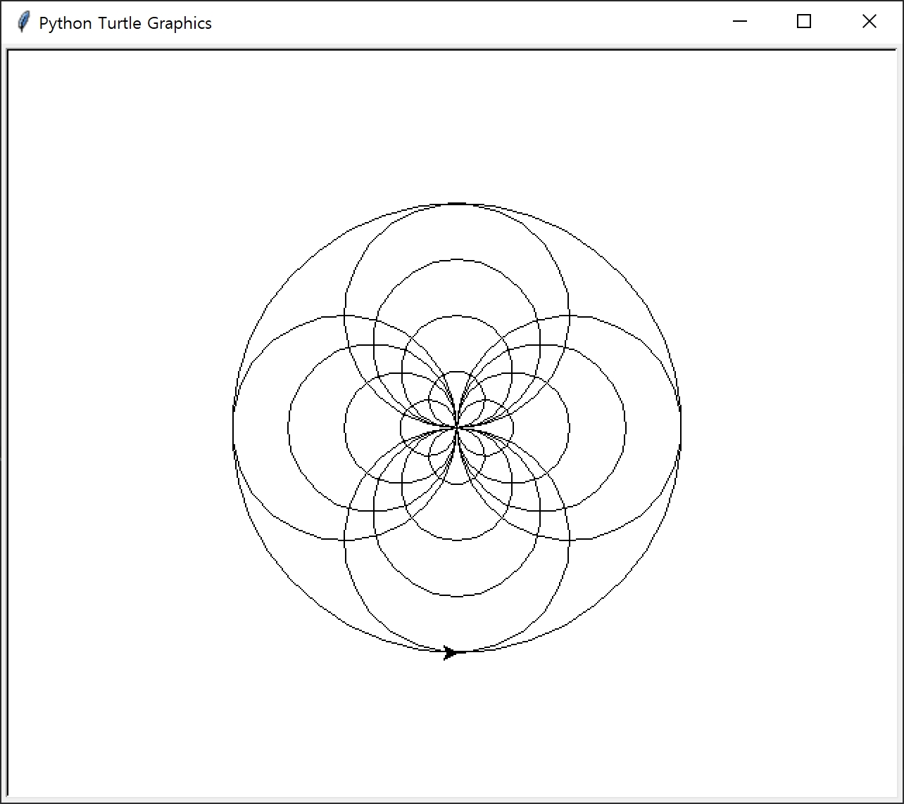

# Homework #2 - The Turtle Practice
python의 standard library 인 turtle library를 이용하여 아래 제시된 문제와 같은 그림을 그리는 코드를 작성하여 각 문제별 코드를 github를 통해 제출하세요.
 
## Introduction to Python Turtle Library
- [Official Turtle Library Documentation](https://docs.python.org/3.7/library/turtle.html)
- [Wikidocs-Turtle(거북이 따라해보기)](https://wikidocs.net/20370)

## Example of Turtle Graphics 01(Basic Star Example)
```
import turtle
 
t = turtle.Turtle()
 
for i in range(5):
    t.forward(150)
    t.right(144)
turtle.done()
```
- Output :


## Example of Turtle Graphics 02(Spiral Star Example)
```
import turtle 

spiral = turtle.Turtle()

for i in range(20):
    spiral.forward(i * 10)
    spiral.right(144)
    
turtle.done()
```
- Output :


## Problem 01(Spiral Square)
- Output :

- 위와 같은 그림을 그리는 turtle 코드를 작성하세요.
- 조건 1 : 최종 도형은 총 50개의 직선으로 이루어져야함
- 조건 2 : 도형은 화면의 중앙에서 시작하여 반시계 방향으로 그려져야함
- Hint : for loop, range()
- 제출 파일명 : 01.py
- 결과적으로, 작성된 코드는 아래와 같은 구조가 되어야함
```
import turtle

...
(your code here)
...
turtle.done()
```

## Problem 02(Recursive Circle)

- 위와 같은 그림을 그리는 turtle 코드를 작성하세요.
- 조건 1 : 그림을 구성하는 circle은 총 17개
- 조건 2 : circle은 안쪽에서 부터 하나씩 시계방향으로 순서대로 그려야 하며 circle 하나를 그릴 때마다 다음 circle은 90도씩 회전함
- 조건 3 : 4개 circle 마다 radius 는 두배 씩 증가
- 조건 4 : 마지막 17번째 circle은 여태까지 그려진 모든 circle을 감싸야함
- Hint : for loop, range()
- 제출 파일명 : 02.py
- 결과적으로, 작성된 코드는 아래와 같은 구조가 되어야함
```
import turtle

...
(your code here)
...
turtle.done()
```

## Problem 03(Fractal)

- Fractal : 프랙탈(영어: fractal)은 일부 작은 조각이 전체와 비슷한 기하학적 형태를 말한다. 이런 특징을 자기 유사성이라고 하며, 다시 말해 자기 유사성을 갖는 기하학적 구조를 프랙탈 구조라고 한다.
- 위와 같은 level에 따른 fractal triangle을 그리는 코드를 작성하세요.
- 조건 1 : 코드 내에 draw_triangle(level) 함수를 선언하고 입력 받은 level 에 따른 fractal triangle 을 그리는 함수 구현
- 조건 2 : 작성된 함수 하단에 level=5 의 fractal triangle 을 그리는 코드를 삽입하여 최종적으로 해당 코드는 실행 시 level 5의 fractal triangle을 그리도록 하여야 함
- 조건 3 : 필요 시 draw_triangle는 기본 구현하고, 추가적으로 개인이 필요한 별도의 함수를 선언해도 무방함
- 조건 4 : 완성된 fractal 도형의 크기는 level 과 상관 없이 동일해야함(가장 외곽선의 삼각형 크기)
- 제출 파일명 : 03.py
- 결과적으로, 작성된 코드는 아래와 같은 구조가 되어야함
```
import turtle
def draw_triangle(level):

    ...
    (your code here)
    ...
    turtle.done()

draw_triangle(level=5)

```


## code 작성 방법
- 출력되는 도형의 크기는 육안으로 식별 가능한 수준이면 문제 없음. 정확한 크기보다는 형태를 체점
- 출력되는 도형의 색상은 체점 대상이 아님. black 색상으로 작성할 것
- Code 에 정답은 없음. 문제에 제시된 도형과 동일한 형태의 그림이 출력되는지만을 체점
- Python Indentation 등 기본적인 Python 문법 준수 필요
- Slide 05 의 debugging technique 참고하여 break point 설정하여 step-by-step으로 그림이 그려지는 과정을 확인하길 권장함
- 본인이 왜 그렇게 코드를 작성하였는지 line-by-line으로 Comments(주석) 달 것

## 주의사항
- Syntax error 등으로 실행이 안되는 코드는 0점 처리
- 아래 제출 방법을 준수하지 않을 경우 감점 혹은 0점 처리
- 타인의 코드를 그대로 Copy & Paste 하지말것(주석의 내용 등을 보았을 때 본인이 작성하지 않은 것으로 보이면 감점 혹은 0점 처리)
- 개인이 체감하는 난이도 상 완성본 제출이 어려울 경우 중간 단계의 코드라도 제출 할 것

## 제출 방법
- Github Login
- https://gist.github.com/ 이동 "Create a new gist"
- Get description 부분에 HW02-학번-이름 기입 (ex. HW02-2018123456-한성균)
- Add file 버튼
- Filename / 작성된 코드 본문 붙여 넣기 후 "Create Secret Gist" 클릭
- 아래 Form을 통해 생성된 Github gist 링크 제출 
- https://docs.google.com/forms/d/e/1FAIpQLSfTLMQC1ApogfhdGLntalFIS2G5EAMJwrcgAqmsSg20F1TFLQ/viewform?usp=sf_link

## Due Date
 - 2019-09-22 20:59
