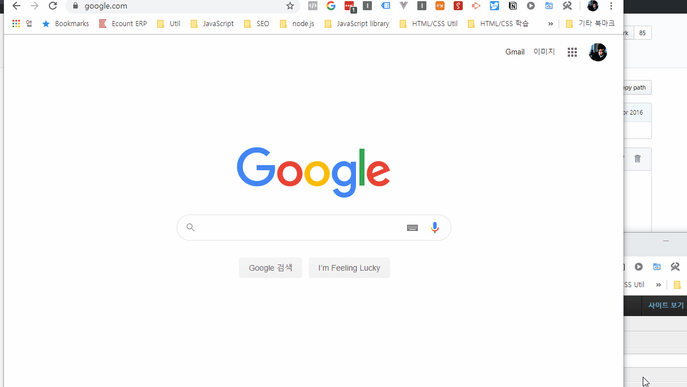

# Notice #6 - 프로젝트 세팅 가이드라인
## Git Repository(팀원 중 대표 1명이 세팅하는 부분)

repository에 접속했을 때 처음 보이는 화면

* 팀원 중 대표가 Lab 강의 슬라이드에 따라 정상적으로 local repository를 Github remote repository에 반영했을 때 repository 접속 시 표시되는 화면의 형태는 위 그림과 같아야 함.
* manage.py 가 project root에 나와 있어야 함.
* .gitignore가 porject root에 존재하며, 강의 슬라이드에 링크 걸려 있는 .gitignore의 내용과 동일한 내용을 가지고 있어야 함.
* 프로젝트 명(위 그림의 경우 "web_project")과 동일한 디렉토리가 project root에 존재하여야 하며 해당 디렉토리 안에는 ```__init__.py, settings.py, urls.py, wsgi.py```가 존재하여야 함
* .idea 등 PyCharm IDE와 관련된 파일이 project root에 존재해서는 안됨(.gitignore를 정상적으로 추가하고 프로젝트 파일들을 커밋하였을 경우 .idea가 없어야 정상)
* 프로젝트에는 모든 팀원과 강의자가 collaborator로 추가되어 있어야함
* 위 항목 중 어느 한 항목이라도 본인 team repository와 다른 부분이 있을 경우 잘못 세팅 된 것이며, 추후 프로젝트 진행 및 채점에 불이익이 있을 수 있으므로 반드시 수정할 것.

## Git Clone 후 PyCharm 에서 프로젝트를 여는 방법
* 위와 같이 팀원 1명이 Github remote repository를 정상적으로 세팅하였을 경우, 나머지 팀원들은 **PyCharm에서 신규로 프로젝트를 생성하는 것이 아니라** Github Remote Repository를 Clone하고, Clone을 통해 생성된 디렉토리를 PyCharm에서 열어야 합니다.

1. 강의 슬라이드 안내에 따라서 git 컴퓨터에 세팅
2. 초대받은 Github Repository URL에 접속
3. 파일 목록 상단 우측 "Clone or download" 클릭
4. Clone with HTTPS 에 나오는 URL 복사
5. 시작 > 검색 > "cmd" 입력하여 <명령 프롬프트> 실행
6. 본인 컴퓨터에서 프로젝트 디렉토리가 저장되길 희망하는 경로로 이동(cd "경로" 입력하면 원하는 경로로 이동 가능함 ex. ```cd c:\Users\jeffr\Documents```)
7. git clone "3.에서 복사한 URL 입력"
8. git clone이 완료되면 해당 경로에 repository 이름과 동일한 프로젝트 디렉토리가 생성됨

9. Pycharm 실행
10. File > Open 선택 후 Clone 받은 프로젝트 디렉토리 클릭 후 Open.
11. 프로젝트 로드 완료 이후 프로젝트 실행 가능여부, manage.py shell 등 Django 명령어 정상 작동여부 확인

* 각 팀원은 위 절차 대로 진행 후 PyCharm에서 정상적으로 프로젝트 실행까지 확인하여야 하며 추후 PyCharm에서 프로젝트 코드 작성 이후 git commit & push & pull 을 통해서 팀원들과 코드의 변경사항을 공유 할 수 있음.
